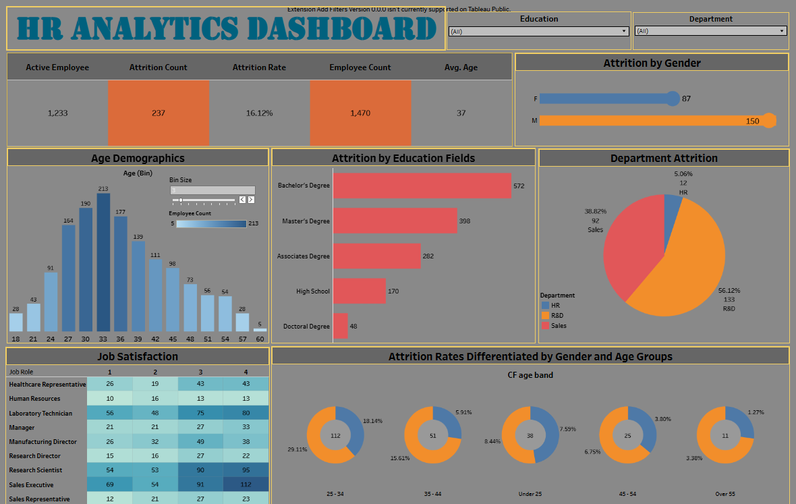

# 📊 HR Analytics Dashboard

This Tableau project analyzes key HR metrics to help understand employee attrition patterns and workforce demographics.

The dashboard includes visualizations on:

* Overall attrition rate and count
* Attrition breakdown by gender, department, and education fields
* Age demographics distribution
* Job satisfaction across different roles
* Attrition rates differentiated by gender and age groups

## ✅ Purpose

The dashboard aims to:

* Identify groups with higher attrition risk
* Understand employee demographics and satisfaction levels
* Provide actionable insights to HR teams to improve retention

## ⚙ Tools & Technologies

* [!Tableau Public](https://public.tableau.com/app/profile/komal.gupta7818/viz/HRAnalyticsDashboard_17514381553940/Dashboard1)
* Excel

## ✅ Dashboard

## 📈 Insights from the Dashboard

From the visualizations, some key insights include:

1. **Overall Attrition Rate:**

   * Total attrition rate is about 16.12% with 237 employees who left out of 1,470.

2. **Attrition by Gender:**

   * Male employees account for a higher number of attritions (150) compared to female employees (87).

3. **Department-wise Attrition:**

   * Highest attrition is in the R&D department (56.12%), followed by Sales (38.82%) and HR (5.06%).

4. **Attrition by Education:**

   * Employees with a Bachelor’s Degree have the highest attrition count (572), followed by those with a Master’s Degree (398).

5. **Age Demographics:**

   * The most common age group of employees is 31–35 years, followed by 26–30 years.
   * Average employee age is 37.

6. **Job Satisfaction:**

   * Some roles like Research Scientists and Laboratory Technicians show higher dissatisfaction (more counts in lower satisfaction scores).

7. **Attrition Rates by Age and Gender:**

   * Highest attrition is seen in the 25–34 age band (29.11% female, 18.14% male).
   * Attrition decreases significantly in older age bands (Over 45 years).
