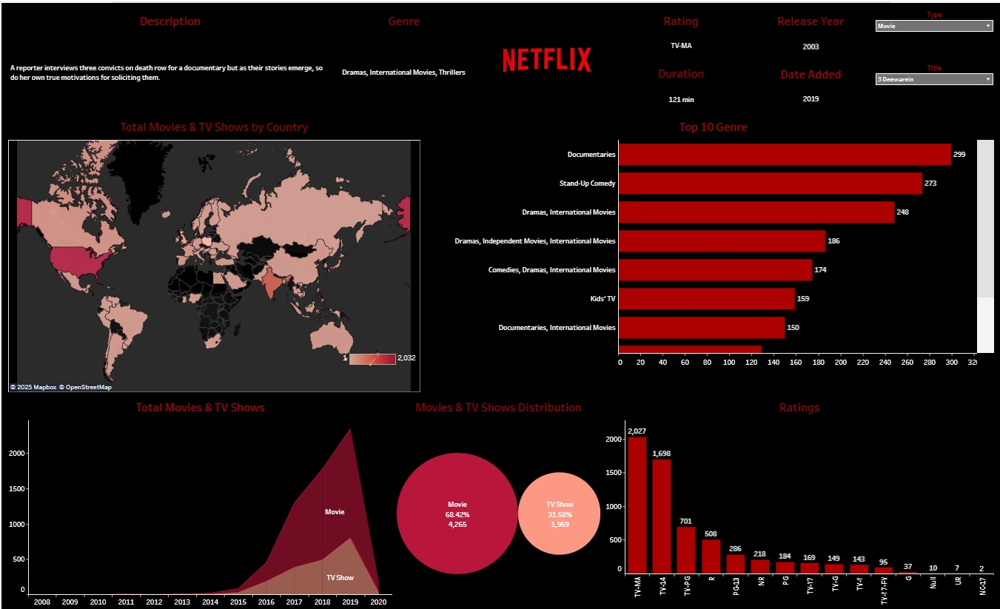

# 📊 Netflix Dashboard

This Tableau project analyzes Netflix's catalog to explore the distribution of movies and TV shows, popular genres, content ratings, and geographic availability.

The dashboard includes visualizations on:

* Total movies & TV shows by country (world map)
* Top 10 most common genres
* Growth trend of total titles over years
* Distribution between movies and TV shows
* Content ratings breakdown

## ✅ Purpose

The dashboard aims to:

* Understand content spread across countries
* Identify the most popular genres on Netflix
* Explore trends in Netflix's content catalog over time
* Analyze the balance between movies vs TV shows
* Examine content ratings distribution

## ⚙ Tools & Technologies

* [!Tableau Public](https://public.tableau.com/app/profile/komal.gupta7818/viz/NetflixDashboard_17518818401330/Netflix)
* Excel

## ✅ Dashboard

## 📈 Insights from the Dashboard

From the visualizations, some key insights include:

1. **Total Movies & TV Shows by Country:**

    * The US has the highest number of titles available (over 2,000).
    * Significant content availability also seen in Canada, UK, and India.
    * Many countries in Africa and parts of Asia have very limited Netflix catalogs.

2. **Top 10 Genres:**

    * Documentaries lead with 299 titles.
    * Followed by Stand-Up Comedy (273) and Dramas, International Movies (248).
    * Other notable genres include Dramas, Independent Movies, International Movies (186), and Kids' TV (159).

3. **Growth Trend:**

    * Sharp increase in total titles between 2015–2018, peaking around 2018–2019.
    * Both movies and TV shows increased, but movies still dominate the catalog.

4. **Movies & TV Shows Distribution:**

    * Movies make up around 68.42% (4,265 titles).
    * TV shows account for 31.56% (1,969 titles).

5. **Content Ratings:**

    * Largest share of titles is TV-MA (2,027 titles), indicating mature content.
    * Other top ratings: TV-14 (1,698), TV-PG (701), and R-rated content (508).
    * Smaller counts in family-friendly ratings like TV-Y, G, and PG.
